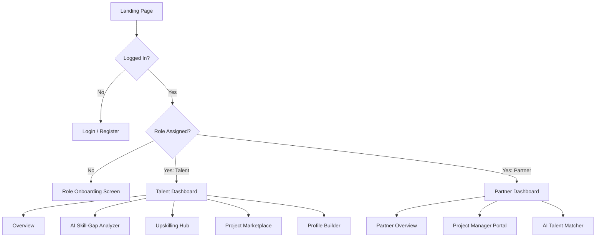

# EdgeTalent Architectural & Agentic Coding Blueprint (OpenRouter Edition)

This blueprint defines the architecture, database schema, security policies, edge functions, and UI structure for **EdgeTalent**, a digital ecosystem bridging talent development (EdgeTalent Foundation) and industrial demand (EdgeTalent Group).

---

## 1. Multi-Agent Team Definition

To construct this ecosystem efficiently, we define three specialized AI agents:

| Agent Name | Primary Responsibility | Key Files / Boundaries |
| :--- | :--- | :--- |
| **Database & Security Agent (DB Agent)** | Database schema, RLS policies, custom Postgres functions/RPCs for vector similarity, triggers. | `supabase/migrations/*.sql` |
| **Edge Function Agent** | Deno TypeScript Edge Functions, OpenRouter API integration, CV parsing, embedding generation, database updates. | `supabase/functions/analyze-skill-gap/index.ts`, `supabase/functions/generate-project-embeddings/index.ts` |
| **Static Frontend Agent** | SPA React structure (Vite), dynamic theme, auth flows, role onboarding, Talent and Partner dashboards, Supabase integrations. | `src/components/*`, `src/pages/*`, `src/context/*`, `src/App.jsx` |

---

## 2. AI & OpenRouter Integration Configuration

To power the AI analysis and semantic matching, we will configure Supabase Edge Functions with the OpenRouter API.

### Required Secrets
Set these secrets in your Supabase project using the Supabase CLI or Dashboard:
```bash
supabase secrets set OPENROUTER_API_KEY="your-openrouter-key"
```

### Model Selection
1. **AI Skill-Gap & CV Analysis (Text Generation):**
   - **Model:** `google/gemini-2.5-flash` or `meta-llama/llama-3.3-70b-instruct`
   - **Endpoint:** `https://openrouter.ai/api/v1/chat/completions`
2. **Semantic Matching Embeddings:**
   - **Model:** `openai/text-embedding-3-small` (Outputs 1536 dimensions)
   - **Endpoint:** `https://openrouter.ai/api/v1/embeddings`

---

## 3. Database & Security Architecture

### pgvector Embedding Setup
We will use **1536-dimensional** embeddings (generated by `openai/text-embedding-3-small` via OpenRouter).

### SQL Schema (`supabase/migrations/20260704000000_init_schema.sql`)

```sql
-- Enable pgvector extension
CREATE EXTENSION IF NOT EXISTS vector;

-- 1. Profiles Table
CREATE TABLE IF NOT EXISTS public.profiles (
    id UUID REFERENCES auth.users ON DELETE CASCADE PRIMARY KEY,
    updated_at TIMESTAMPTZ DEFAULT TIMEZONE('utc'::text, NOW()) NOT NULL,
    full_name TEXT,
    email TEXT,
    avatar_url TEXT,
    role TEXT CHECK (role IN ('talent', 'partner', 'admin')),
    bio TEXT,
    portfolio_links JSONB DEFAULT '{}'::jsonb,
    skills TEXT[] DEFAULT '{}'::text[],
    skill_gaps TEXT[] DEFAULT '{}'::text[],
    skills_embedding vector(1536), -- Matches OpenRouter openai/text-embedding-3-small
    created_at TIMESTAMPTZ DEFAULT TIMEZONE('utc'::text, NOW()) NOT NULL,
    CONSTRAINT email_unq UNIQUE (email)
);

-- 2. Courses Table (Upskilling Hub)
CREATE TABLE IF NOT EXISTS public.courses (
    id UUID PRIMARY KEY DEFAULT gen_random_uuid(),
    title TEXT NOT NULL,
    description TEXT,
    skills_taught TEXT[] DEFAULT '{}'::text[],
    provider TEXT,
    link TEXT,
    created_at TIMESTAMPTZ DEFAULT TIMEZONE('utc'::text, NOW()) NOT NULL
);

-- 3. Projects Table (Marketplace)
CREATE TABLE IF NOT EXISTS public.projects (
    id UUID PRIMARY KEY DEFAULT gen_random_uuid(),
    partner_id UUID REFERENCES public.profiles(id) ON DELETE CASCADE NOT NULL,
    title TEXT NOT NULL,
    description TEXT NOT NULL,
    required_skills TEXT[] DEFAULT '{}'::text[],
    budget NUMERIC,
    scope TEXT CHECK (scope IN ('short-term', 'medium-term', 'long-term')),
    embedding vector(1536), -- Matches OpenRouter openai/text-embedding-3-small
    created_at TIMESTAMPTZ DEFAULT TIMEZONE('utc'::text, NOW()) NOT NULL
);

-- 4. Applications Table
CREATE TABLE IF NOT EXISTS public.applications (
    id UUID PRIMARY KEY DEFAULT gen_random_uuid(),
    project_id UUID REFERENCES public.projects(id) ON DELETE CASCADE NOT NULL,
    talent_id UUID REFERENCES public.profiles(id) ON DELETE CASCADE NOT NULL,
    status TEXT CHECK (status IN ('applied', 'reviewing', 'shortlisted', 'accepted', 'rejected')) DEFAULT 'applied' NOT NULL,
    match_percentage NUMERIC CHECK (match_percentage >= 0 AND match_percentage <= 100),
    match_breakdown JSONB DEFAULT '{}'::jsonb,
    applied_at TIMESTAMPTZ DEFAULT TIMEZONE('utc'::text, NOW()) NOT NULL,
    CONSTRAINT unique_talent_project_application UNIQUE (project_id, talent_id)
);

-- Enable Row Level Security (RLS)
ALTER TABLE public.profiles ENABLE ROW LEVEL SECURITY;
ALTER TABLE public.courses ENABLE ROW LEVEL SECURITY;
ALTER TABLE public.projects ENABLE ROW LEVEL SECURITY;
ALTER TABLE public.applications ENABLE ROW LEVEL SECURITY;
```

### Row Level Security (RLS) Policies

```sql
-- =========================================================================
-- PROFILES POLICIES
-- =========================================================================
CREATE POLICY "Profiles viewable by authenticated users" 
ON public.profiles FOR SELECT 
TO authenticated 
USING (true);

CREATE POLICY "Users can update their own profile" 
ON public.profiles FOR UPDATE 
TO authenticated 
USING (auth.uid() = id)
WITH CHECK (auth.uid() = id);

-- Trigger to create profile automatically on auth.users sign-up
CREATE OR REPLACE FUNCTION public.handle_new_user()
RETURNS trigger AS $$
BEGIN
  INSERT INTO public.profiles (id, full_name, email, avatar_url, role)
  VALUES (
    new.id,
    COALESCE(new.raw_user_meta_data->>'full_name', new.raw_user_meta_data->>'name', ''),
    new.email,
    COALESCE(new.raw_user_meta_data->>'avatar_url', ''),
    NULL -- To be updated on onboarding role selection
  );
  RETURN NEW;
END;
$$ LANGUAGE plpgsql SECURITY DEFINER;

CREATE OR REPLACE TRIGGER on_auth_user_created
  AFTER INSERT ON auth.users
  FOR EACH ROW EXECUTE FUNCTION public.handle_new_user();

-- =========================================================================
-- COURSES POLICIES
-- =========================================================================
CREATE POLICY "Courses are viewable by everyone" 
ON public.courses FOR SELECT 
TO public 
USING (true);

CREATE POLICY "Only admins can modify courses" 
ON public.courses FOR ALL 
TO authenticated 
USING (
    EXISTS (SELECT 1 FROM public.profiles WHERE profiles.id = auth.uid() AND profiles.role = 'admin')
);

-- =========================================================================
-- PROJECTS POLICIES
-- =========================================================================
CREATE POLICY "Projects are viewable by everyone" 
ON public.projects FOR SELECT 
TO public 
USING (true);

CREATE POLICY "Partners can insert projects" 
ON public.projects FOR INSERT 
TO authenticated 
WITH CHECK (
    EXISTS (SELECT 1 FROM public.profiles WHERE profiles.id = auth.uid() AND profiles.role = 'partner') 
    AND auth.uid() = partner_id
);

CREATE POLICY "Partners can update/delete their own projects" 
ON public.projects FOR ALL 
TO authenticated 
USING (auth.uid() = partner_id)
WITH CHECK (auth.uid() = partner_id);

-- =========================================================================
-- APPLICATIONS POLICIES
-- =========================================================================
CREATE POLICY "Users can view relevant applications" 
ON public.applications FOR SELECT 
TO authenticated 
USING (
    auth.uid() = talent_id OR 
    EXISTS (SELECT 1 FROM public.projects WHERE projects.id = applications.project_id AND projects.partner_id = auth.uid())
);

CREATE POLICY "Talents can submit applications" 
ON public.applications FOR INSERT 
TO authenticated 
WITH CHECK (
    auth.uid() = talent_id AND 
    EXISTS (SELECT 1 FROM public.profiles WHERE profiles.id = auth.uid() AND profiles.role = 'talent')
);

CREATE POLICY "Partners can update application status" 
ON public.applications FOR UPDATE 
TO authenticated 
USING (
    EXISTS (SELECT 1 FROM public.projects WHERE projects.id = applications.project_id AND projects.partner_id = auth.uid())
)
WITH CHECK (
    EXISTS (SELECT 1 FROM public.projects WHERE projects.id = applications.project_id AND projects.partner_id = auth.uid())
);
```

### Vector Matching RPCs (Remote Procedure Calls)

```sql
-- Match talents for a specific project based on profile embedding similarity
CREATE OR REPLACE FUNCTION public.match_talents_for_project(
    p_project_id UUID,
    p_match_limit INT DEFAULT 10
)
RETURNS TABLE (
    talent_id UUID,
    full_name TEXT,
    email TEXT,
    skills TEXT[],
    bio TEXT,
    similarity NUMERIC
) AS $$
DECLARE
    v_project_embedding vector(1536);
BEGIN
    SELECT embedding INTO v_project_embedding FROM public.projects WHERE id = p_project_id;
    
    RETURN QUERY
    SELECT 
        p.id AS talent_id,
        p.full_name,
        p.email,
        p.skills,
        p.bio,
        (1 - (p.skills_embedding <=> v_project_embedding))::numeric AS similarity
    FROM public.profiles p
    WHERE p.role = 'talent' AND p.skills_embedding IS NOT NULL
    ORDER BY p.skills_embedding <=> v_project_embedding
    LIMIT p_match_limit;
END;
$$ LANGUAGE plpgsql SECURITY DEFINER;

-- Match projects for a specific talent based on skills embedding similarity
CREATE OR REPLACE FUNCTION public.match_projects_for_talent(
    p_talent_id UUID,
    p_match_limit INT DEFAULT 10
)
RETURNS TABLE (
    project_id UUID,
    title TEXT,
    description TEXT,
    budget NUMERIC,
    scope TEXT,
    required_skills TEXT[],
    similarity NUMERIC
) AS $$
DECLARE
    v_talent_embedding vector(1536);
BEGIN
    SELECT skills_embedding INTO v_talent_embedding FROM public.profiles WHERE id = p_talent_id;
    
    RETURN QUERY
    SELECT 
        pr.id AS project_id,
        pr.title,
        pr.description,
        pr.budget,
        pr.scope,
        pr.required_skills,
        (1 - (pr.embedding <=> v_talent_embedding))::numeric AS similarity
    FROM public.projects pr
    WHERE pr.embedding IS NOT NULL
    ORDER BY pr.embedding <=> v_talent_embedding
    LIMIT p_match_limit;
END;
$$ LANGUAGE plpgsql SECURITY DEFINER;
```

---

## 4. Edge Functions AI Engine Blueprint (using OpenRouter API)

### A. `analyze-skill-gap` Function (`supabase/functions/analyze-skill-gap/index.ts`)
- **Headers Required:**
  - `Authorization: Bearer ${Deno.env.get("OPENROUTER_API_KEY")}`
  - `HTTP-Referer: https://edgetalent.github.io`
  - `X-Title: EdgeTalent`
- **Execution flow:**
  1. Call OpenRouter API at `https://openrouter.ai/api/v1/chat/completions` using the `google/gemini-2.5-flash` model.
  2. Pass a system instruction instructing the model to parse the user's CV or quiz details and return a clean JSON payload mapping:
     - `skills`: array of strings.
     - `skill_gaps`: array of strings.
     - `bio`: a short summarized profile for vector matching.
  3. Call OpenRouter API at `https://openrouter.ai/api/v1/embeddings` using the model `openai/text-embedding-3-small` with the bio text.
  4. Write the updated arrays and the resulting `vector(1536)` embedding into the database `profiles` table.
  5. Respond to the client with the parsed information.

### B. `generate-project-embeddings` Function (`supabase/functions/generate-project-embeddings/index.ts`)
- **Execution flow:**
  1. Formulate project search string: `"Project: [title]. Required skills: [required_skills]. Description: [description]"`
  2. Call OpenRouter API at `https://openrouter.ai/api/v1/embeddings` with model `openai/text-embedding-3-small` using the search string.
  3. Store the returned 1536-dimensional array into `projects.embedding` via a direct database query using the service role client.

---

## 5. Frontend Menu Structure & Functionalities

Built as a Single Page Application using **React + Vite**, routed via **HashRouter** (crucial for GitHub Pages deployments), styled with premium Vanilla CSS.

### UI Flow Architecture


### Dynamic Theme & Style System (`src/index.css`)
- Sleek dark theme with cybernetic blue/cyan accents (`#06b6d4`, `#3b82f6`) representing the downstream commercial sector, mixed with warm amber/emerald highlights (`#10b981`, `#f59e0b`) representing downstream talent development.
- Glassmorphism surfaces (`backdrop-filter: blur(12px)`) for modern card panels.
- Micro-interactions (hover scale transitions, glowing button rings).

---

## 6. Step-by-Step Execution Roadmap

### Phase 1: DB & Security Setup (DB Agent)
1. **Initialize Supabase Migrations:** Create a migration containing the schemas for `profiles`, `courses`, `projects`, and `applications`.
2. **Postgres Triggers:** Add the automatic profile creator trigger `handle_new_user`.
3. **RLS Policies:** Write standard policies restricting updates to owners, and permitting reads for authenticated users.
4. **pgvector Matches:** Add Postgres RPC functions `match_talents_for_project` and `match_projects_for_talent`.

### Phase 2: Edge Functions Development (Edge Function Agent)
1. **OpenRouter Client Setup:** Set up HTTP requests to `openrouter.ai` endpoints with appropriate API headers.
2. **`analyze-skill-gap` function:** Parse input documents or CV text, construct LLM prompts, invoke OpenRouter chat completion and embedding APIs, and update `profiles`.
3. **`generate-project-embeddings` function:** Generate embeddings for project postings using OpenRouter embedding API and update `projects`.

### Phase 3: Auth & Onboarding UI (Static Frontend Agent)
1. **App Scaffold:** Initialize a React Vite app, configure `src/index.css` for a premium glassmorphic dark UI, and set up `HashRouter`.
2. **Auth Views:** Create beautiful sign-in/sign-up forms connected to Supabase Auth.
3. **Role Onboarding:** Build a modal/onboarding screen appearing immediately if `profile.role` is null. It prompts the user to select "Talent" or "Partner/Company". Selecting a role updates the profile table.

### Phase 4: Talent Dashboard (Static Frontend Agent)
1. **AI Skill-Gap Panel:** Interface for CV upload (or text paste) and quick quiz. Clicking "Analyze" displays a loading state and queries the `/analyze-skill-gap` edge function, dynamically rendering the output gaps and recommendations.
2. **Upskilling Hub:** Displays cards from the `courses` table that match the identified `skill_gaps`.
3. **Marketplace:** Lists projects from `projects` fetched using the `match_projects_for_talent` RPC. Showcases the similarity score formatted as "Match Percentage" (e.g., `similarity * 100`).
4. **CV Builder:** Interface to manually input skills, bio, and portfolio links.

### Phase 5: Partner Dashboard (Static Frontend Agent)
1. **Project Portal:** Create a clean form for partners to post new projects (title, description, scope, budget, required skills). Saving the project executes a call to the database (which triggers the embedding generator).
2. **AI Talent Matcher:** Displays talent listings. Selecting a project calls `match_talents_for_project` RPC, highlighting matching talents in ranking order.

---

## Verification Plan

### Automated Tests
- Test RLS policies using Supabase CLI unit tests (`supabase db test`).
- Test vector calculation using sample pgvector insertion and cosine similarity searches.
- Direct endpoint curl tests to Edge Functions using test JSON payloads.

### Manual UI Verification
- Flow verification: Sign up new user -> onboarding role selector -> check database updates.
- Talent CV upload -> check AI gaps update -> verify Courses matching gaps.
- Partner project posting -> verify embedding generated -> view recommendation matches.
